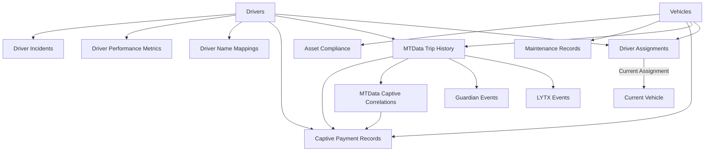

# Data Centre Entity Relationship Diagram (ERD)

## Overview

This document describes the relationships between all Data Centre tables after the cleanup and optimization process.

---

## Core Entity Tables

### 1. **Drivers** (Master Driver Registry)

```
drivers
├── id (UUID, PK)
├── first_name
├── last_name
├── employee_id (UNIQUE)
├── fleet
├── depot
├── status
└── ...
```

**Relationships:**
- `drivers.id` → `driver_name_mappings.driver_id` (1:N)
- `drivers.id` → `driver_performance_metrics.driver_id` (1:N)
- `drivers.id` → `driver_incidents.driver_id` (1:N)
- `drivers.id` → `driver_assignments.driver_id` (1:N)
- `drivers.id` → `mtdata_trip_history.driver_id` (1:N)
- `drivers.id` → `lytx_safety_events.driver_id` (1:N)
- `drivers.id` → `guardian_events.driver_id` (1:N)
- `drivers.id` → `captive_payment_records.driver_id` (1:N)

---

### 2. **Vehicles** (Master Vehicle Registry)

```
vehicles
├── id (UUID, PK)
├── registration (UNIQUE)
├── fleet
├── depot
├── guardian_unit
├── lytx_device
└── ...
```

**Relationships:**
- `vehicles.id` → `driver_assignments.vehicle_id` (1:N)
- `vehicles.id` → `maintenance_records.vehicle_id` (1:N)
- `vehicles.id` → `asset_compliance.vehicle_id` (1:N)
- `vehicles.id` → `mtdata_trip_history.vehicle_id` (1:N)
- `vehicles.id` → `lytx_safety_events.vehicle_id` (1:N)
- `vehicles.id` → `guardian_events.vehicle_id` (1:N)
- `vehicles.id` → `captive_payment_records.vehicle_id` (1:N)

---

### 3. **MTData Trip History** (Trip Records)

```
mtdata_trip_history
├── id (UUID, PK)
├── vehicle_id (FK → vehicles)
├── driver_id (FK → drivers)
├── start_time
├── end_time
├── distance_km
└── ...
```

**Relationships:**
- `mtdata_trip_history.id` → `lytx_safety_events.mtdata_trip_id` (1:N)
- `mtdata_trip_history.id` → `guardian_events.mtdata_trip_id` (1:N)
- `mtdata_trip_history.id` → `mtdata_captive_correlations.mtdata_trip_id` (1:N)
- `mtdata_trip_history.id` → `captive_payment_records.mtdata_trip_id` (1:N)

---

## Event Tables

### 4. **LYTX Safety Events**

```
lytx_safety_events
├── id (UUID, PK)
├── event_id (UNIQUE)
├── driver_id (FK → drivers)
├── vehicle_id (FK → vehicles)
├── mtdata_trip_id (FK → mtdata_trip_history)
├── event_datetime
├── safety_score
├── trigger_type
└── ...
```

**Correlation Path:**
```
Driver → Vehicle → Trip → LYTX Event
```

---

### 5. **Guardian Events**

```
guardian_events
├── id (UUID, PK)
├── event_id (UNIQUE)
├── driver_id (FK → drivers)
├── vehicle_id (FK → vehicles)
├── mtdata_trip_id (FK → mtdata_trip_history)
├── detection_time
├── event_type
├── confirmation
└── ...
```

**Correlation Path:**
```
Driver → Vehicle → Trip → Guardian Event
```

---

## Delivery & Correlation Tables

### 6. **Captive Payment Records** (Raw Delivery Data)

```
captive_payment_records
├── id (UUID, PK)
├── bill_of_lading
├── delivery_date
├── customer
├── vehicle_id (FK → vehicles)
├── driver_id (FK → drivers)
├── mtdata_trip_id (FK → mtdata_trip_history)
├── volume_litres
└── ...
```

**Correlation Path:**
```
Delivery → Trip → Vehicle → Driver
```

---

### 7. **MTData Captive Correlations** (Delivery-Trip Links)

```
mtdata_captive_correlations
├── id (UUID, PK)
├── mtdata_trip_id (FK → mtdata_trip_history)
├── delivery_key
├── confidence_score
├── match_type
└── ...
```

**Purpose:** Links trips to deliveries with confidence scoring

---

## Supporting Tables

### 8. **Driver Name Mappings**

```
driver_name_mappings
├── id (UUID, PK)
├── driver_id (FK → drivers)
├── system_name (LYTX, Guardian, MtData, etc.)
├── mapped_name
└── confidence_score
```

**Purpose:** Handles name variations across different systems

---

### 9. **Driver Assignments**

```
driver_assignments
├── id (UUID, PK)
├── vehicle_id (FK → vehicles)
├── driver_id (FK → drivers)
├── assigned_at
└── unassigned_at
```

**Purpose:** Tracks driver-vehicle assignment history

---

### 10. **Driver Performance Metrics**

```
driver_performance_metrics
├── id (UUID, PK)
├── driver_id (FK → drivers)
├── period_start
├── period_end
├── period_type
├── lytx_events_count
├── guardian_events_count
└── ...
```

**Purpose:** Aggregated performance data by time period

---

## Complete Relationship Flow

### Driver → Vehicle → Trip → Event → Delivery



---

## Key Relationships

### 1. **Driver-Centric View**

A driver has:
- Multiple name mappings (for different systems)
- Performance metrics by period
- Incident history
- Vehicle assignment history
- Trip history
- Associated LYTX events (via trips)
- Associated Guardian events (via trips)
- Associated deliveries (via trips)

### 2. **Vehicle-Centric View**

A vehicle has:
- Driver assignment history
- Maintenance records
- Compliance tracking
- Trip history
- Associated LYTX events
- Associated Guardian events
- Associated deliveries (via trips)

### 3. **Trip-Centric View**

A trip has:
- One vehicle
- One driver
- Multiple LYTX events
- Multiple Guardian events
- Correlated deliveries (via mtdata_captive_correlations)

### 4. **Delivery-Centric View**

A delivery has:
- Correlated trips (via mtdata_captive_correlations)
- Associated vehicle (via trip)
- Associated driver (via trip)
- Associated events (via trip)

---

## Foreign Key Summary

| Table | Foreign Keys |
|-------|--------------|
| `lytx_safety_events` | `driver_id` → drivers<br>`vehicle_id` → vehicles<br>`mtdata_trip_id` → mtdata_trip_history |
| `guardian_events` | `driver_id` → drivers<br>`vehicle_id` → vehicles<br>`mtdata_trip_id` → mtdata_trip_history |
| `mtdata_trip_history` | `driver_id` → drivers<br>`vehicle_id` → vehicles |
| `captive_payment_records` | `driver_id` → drivers<br>`vehicle_id` → vehicles<br>`mtdata_trip_id` → mtdata_trip_history |
| `mtdata_captive_correlations` | `mtdata_trip_id` → mtdata_trip_history |
| `driver_name_mappings` | `driver_id` → drivers |
| `driver_assignments` | `driver_id` → drivers<br>`vehicle_id` → vehicles |
| `driver_performance_metrics` | `driver_id` → drivers |
| `driver_incidents` | `driver_id` → drivers<br>`vehicle_id` → vehicles |
| `maintenance_records` | `vehicle_id` → vehicles |
| `asset_compliance` | `vehicle_id` → vehicles |

---

## Indexes Summary

### Critical Performance Indexes

**Event-Trip Relationships:**
- `idx_lytx_trip_datetime` on `lytx_safety_events(mtdata_trip_id, event_datetime)`
- `idx_guardian_trip_time` on `guardian_events(mtdata_trip_id, detection_time)`

**Driver-Event Relationships:**
- `idx_lytx_driver_date_score` on `lytx_safety_events(driver_id, event_datetime, safety_score)`
- `idx_guardian_driver_time_type` on `guardian_events(driver_id, detection_time, event_type)`

**Vehicle-Event Relationships:**
- `idx_lytx_vehicle_date_score` on `lytx_safety_events(vehicle_id, event_datetime, safety_score)`
- `idx_guardian_vehicle_time_type` on `guardian_events(vehicle_id, detection_time, event_type)`

**Trip-Driver-Vehicle:**
- `idx_trip_driver_starttime` on `mtdata_trip_history(driver_id, start_time)`
- `idx_trip_vehicle_starttime` on `mtdata_trip_history(vehicle_id, start_time)`

**Delivery Correlations:**
- `idx_correlation_trip_confidence` on `mtdata_captive_correlations(mtdata_trip_id, confidence_score)`
- `idx_captive_trip_confidence` on `captive_payment_records(mtdata_trip_id, correlation_confidence)`

---

## Query Patterns

### 1. Get Everything About a Driver

```sql
SELECT get_driver_complete_profile('<driver_id>')::jsonb;
```

Returns:
- Driver info
- Name mappings
- Current vehicle assignment
- Assignment history
- Latest performance metrics
- LYTX events summary
- Guardian events summary
- Trip history summary
- Delivery summary
- Incident summary

### 2. Get Everything About a Vehicle

```sql
SELECT get_vehicle_complete_profile('<vehicle_id>')::jsonb;
```

Returns:
- Vehicle info
- Current driver
- Assignment history
- Maintenance records
- Compliance status
- LYTX events summary
- Guardian events summary
- Trip history summary
- Delivery summary
- Efficiency metrics

### 3. Get Everything About a Trip

```sql
SELECT get_trip_complete_data('<trip_id>')::jsonb;
```

Returns:
- Trip data
- Vehicle info
- Driver info
- LYTX events during trip
- Guardian events during trip
- Correlated deliveries
- Route analysis

---

## Data Flow

### Import → Correlation → Analysis

```
1. CSV/API Import
   ↓
2. Raw Tables (lytx_safety_events, guardian_events, captive_payment_records, mtdata_trip_history)
   ↓
3. Name/Device Matching (populate driver_id, vehicle_id)
   ↓
4. Trip Correlation (populate mtdata_trip_id)
   ↓
5. Correlation Engine (mtdata_captive_correlations)
   ↓
6. Analytics & Views (dvtd_relationships, unified_event_timeline)
   ↓
7. Query Functions (get_driver_complete_profile, etc.)
```

---

## Changes from Previous Schema

### Removed Tables:
- ❌ `carrier_deliveries` (duplicate of captive_payment_records)
- ❌ `upload_batches` (consolidated into data_import_batches)
- ❌ `driver_performance_monthly` (consolidated into driver_performance_metrics)

### Added Columns:
- ✅ `lytx_safety_events.vehicle_id` (UUID FK)
- ✅ `guardian_events.vehicle_id` (UUID FK, was INTEGER)
- ✅ `captive_payment_records.vehicle_id` (UUID FK)
- ✅ `captive_payment_records.driver_id` (UUID FK)
- ✅ `captive_payment_records.mtdata_trip_id` (UUID FK)

### Standardized:
- ✅ All foreign keys use UUID
- ✅ Consistent naming conventions
- ✅ Proper cascading delete rules
- ✅ Association confidence scoring

---

## Maintenance

### Regular Tasks:

1. **Update Statistics:**
   ```sql
   ANALYZE lytx_safety_events;
   ANALYZE guardian_events;
   ANALYZE mtdata_trip_history;
   ANALYZE captive_payment_records;
   ```

2. **Refresh Materialized Views:**
   ```sql
   REFRESH MATERIALIZED VIEW CONCURRENTLY captive_deliveries;
   REFRESH MATERIALIZED VIEW CONCURRENTLY correlation_analytics_summary;
   ```

3. **Monitor Index Usage:**
   ```sql
   SELECT * FROM pg_stat_user_indexes
   WHERE schemaname = 'public'
   ORDER BY idx_scan DESC;
   ```

4. **Check Data Quality:**
   ```sql
   SELECT * FROM data_quality_dashboard;
   ```
